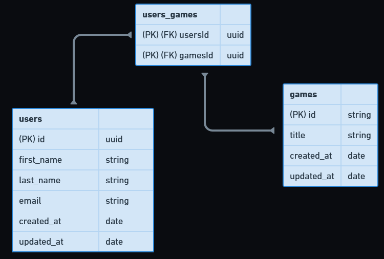

# Desafio-Modelagem-do-banco-de-dados
Rocketseat Challange

O objetivo desse desafio é criar a modelagem do banco de dados da aplicação do desafio anterior [desafio anterior](https://github.com/Fellippemfv/Desafio-Database-Queries.git).

[Instruções](https://www.notion.so/Desafio-02-Modelagem-do-banco-de-dados-0ce9c10f9e114be0a9ee9359d68639ff)

# Diagrama

